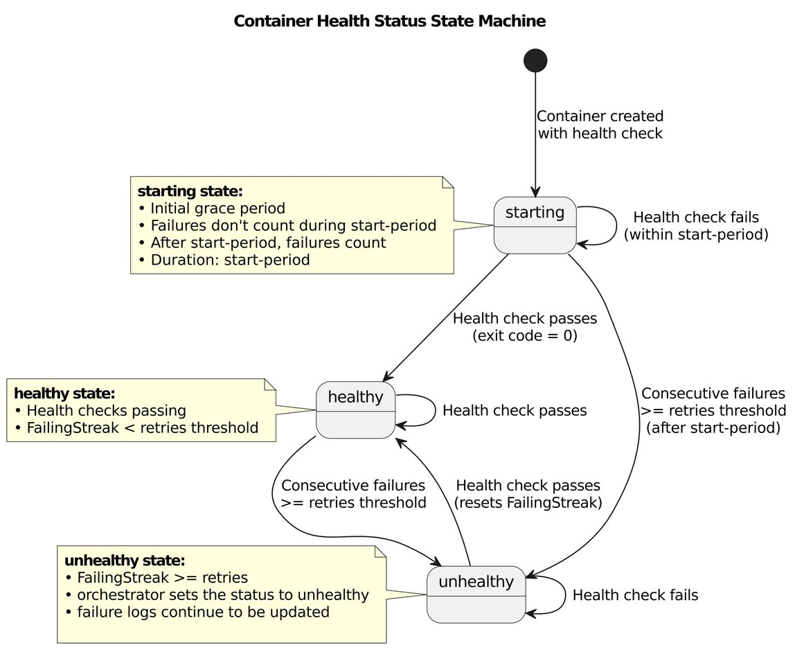
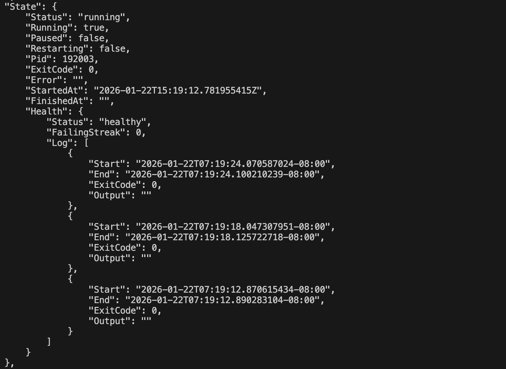
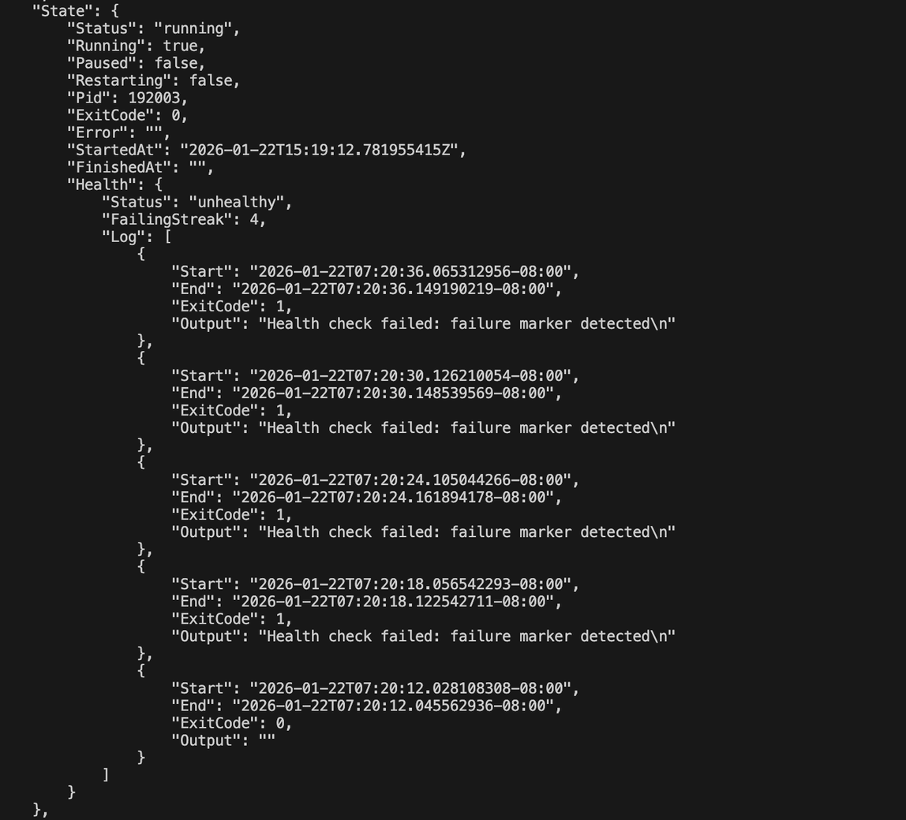
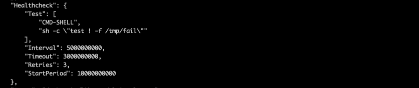

## Introduction

Container health checks are essential for maintaining reliable containerized applications. They allow you to define custom commands that periodically verify your application is functioning correctly, enabling proactive detection of issues before they impact users. Starting with nerdctl v2.1.5, developers can now configure Docker-compatible health checks to monitor the health status of their containers.

In this post, we'll explore why health checks matter, how they work in nerdctl, and walk through practical examples demonstrating their usage. Before diving into health checks, let's first understand nerdctl's architecture, as it directly influences how health checks are implemented.

## nerdctl Architecture Overview

**nerdctl** is a Docker-compatible CLI for **containerd**, the container runtime managing the actual container lifecycle. When you need to build images, **BuildKit** converts your source code into container images, while **CNI plugins** handle all container networking needs.

Unlike Docker, there is no long-running daemon of nerdctl's own sitting between the CLI and the runtime. Every `nerdctl` command is a short-lived process that talks directly to containerd and exits when it's done. This is the property that shapes the whole health check design.

## Why Do We Need Health Checks?

A running container doesn't always mean a healthy application. Containers can experience various issues that keep them running but non-functional:

- **Application deadlocks**: The process is alive but can't handle new requests
- **Dependency failures**: Database connections drop or external services become unreachable
- **Configuration errors**: The application starts but can't perform its intended function

Without health checks, these issues can go undetected until users report problems. Traditional process monitoring only tells you if the container is running, not whether your application is actually working correctly. Having a health check in your container application can help identify issues quickly and take remedial action.

## What are Health Checks?

Health checks are user-defined commands that run periodically inside a container to verify the application is functioning correctly. Based on the command's exit status, the container's health status transitions between:

- **starting**: During the initial container startup period
- **healthy**: When health checks are passing successfully
- **unhealthy**: After a specified number of consecutive failures

## How Health Checks Work in nerdctl

nerdctl implements health checks using a combination of configuration options and orchestration via Systemd timers

### Configuration

Health checks can be configured in two ways:

- **At runtime** using CLI flags with `nerdctl run` or `nerdctl create`:
  - `--health-cmd`: The command to execute for health verification
  - `--health-interval`: How often to run the check (default: 30s)
  - `--health-timeout`: Maximum time allowed for one check (default: 30s)
  - `--health-retries`: Consecutive failures before marking unhealthy (default: 3)
  - `--health-start-period`: Grace period before counting failures (default: 0)
  - `--no-healthcheck`: Disable health checks entirely
- **At build time** using `HEALTHCHECK` instruction in Dockerfiles

### Automatic Scheduling

When you create a container with health checks configured, nerdctl automatically sets up the scheduling infrastructure using systemd timer units on the host.

The systemd-based approach was chosen because, unlike Docker CLI, nerdctl does not communicate with a background daemon (like dockerd).

### Execution Flow

- When a container with health checks starts, nerdctl creates a systemd timer
- The timer triggers at the configured interval
- The health check command executes inside the container
- Based on the exit code (0 = success, non-zero = failure), the health status updates
- After the specified number of consecutive failures, the container is marked unhealthy
- The health status and recent check results are stored and accessible via `nerdctl inspect <container-name>`



_Fig 1: State machine diagram of health check orchestration_

## Under the Hood: Why systemd Timers?

Docker gets health checks almost for free: `dockerd` is a long-running daemon, so it can keep a ticker per container and run probes on schedule. nerdctl deliberately has no daemon. Every `nerdctl` command is a short-lived process that talks to containerd and exits. That raises the core design question: _if nothing of ours stays running after `nerdctl run` returns, who runs the health check every 30 seconds?_

The options come down to:

1. **Add a daemon to nerdctl.** It would work, but it would give up the daemonless model that is one of nerdctl's main differences from Docker, and add a new process to install, supervise, and upgrade.
2. **Spawn a background process per container from the CLI.** Nothing would supervise it. If it crashes, or the machine reboots, health checks silently stop and the status freezes at its last value.
3. **Delegate scheduling to something that is already running.** On most Linux systems that is systemd, a mature scheduler and process supervisor that is already PID 1.

We went with the third option. nerdctl borrows systemd's scheduler instead of building its own.

### How it's wired together

When you create a container with a health check, nerdctl uses `systemd-run` to create a **transient timer and service** pair, both named after the container ID. The service runs one command: `nerdctl container healthcheck <container-id>`.

That subcommand is the heart of the design. It is an ordinary, one-shot CLI command that:

1. Runs the probe inside the container as a containerd exec process, enforcing `--health-timeout`
2. Updates the health state machine (start period, failing streak, status) from Fig 1
3. Persists the state and exits

Because the health check is just another CLI invocation, you can run `nerdctl container healthcheck` by hand to debug a check. nerdctl never has to stay resident.

A few details matter here:

- **No overlapping probes.** The timer uses `--on-unit-inactive=<interval>`. The next check is scheduled relative to when the previous one _finished_, not on a fixed clock, so a slow probe can never pile up concurrent runs.
- **Tight scheduling.** systemd timers coalesce wakeups by default (up to a minute of slack). nerdctl sets `AccuracySec=1s`, so a `5s` interval really means about 5 seconds.
- **Self-cleaning units.** Transient units are created with `--collect`, so systemd garbage-collects them even when the last run failed, for example after the container stopped. `nerdctl stop`, `kill`, and `rm` tear down the timer, and any stale timer left over from a previous run is removed before a new one is created.

### Where the state lives

With no daemon, there is no in-memory store. Health state has to live somewhere every short-lived `nerdctl` process can read:

- The **current status and failing streak** are stored as a label on the containerd container object, so `nerdctl inspect` can read them like any other container metadata.
- The **probe results log** is appended to a `health.json` file in the container's state directory, guarded by a file lock because the timer-driven check and an `inspect` can run at the same time. Inspect shows the last 5 results, matching Docker.

### The trade-offs

This design isn't free, and it's worth being upfront about what we traded:

- **systemd is a hard dependency for automatic checks.** Without systemd, checks don't run on a schedule, though `nerdctl container healthcheck` still works for external schedulers. For tools that run nerdctl inside a managed Linux VM, like [Finch](https://runfinch.com/) on macOS and Windows, this is a non-issue because the VM image always ships systemd.
- **Rootful only, for now.** Automatic scheduling is skipped for rootless containers, which would need to go through the user's systemd instance. The examples below assume rootful nerdctl.
- **Opt-out switch.** Environments that don't want nerdctl creating systemd units can set `disable_hc_systemd = true` in `nerdctl.toml`.
- **Each probe costs a process launch.** Every check starts a fresh `nerdctl` process instead of reusing a warm daemon. For intervals measured in seconds, that overhead is negligible next to the probe itself.
- **Not every Docker flag is there yet.** `--health-start-interval` is not currently supported.

What we got in return is Docker-compatible health checks with no new long-running component, scheduling and supervision from a battle-tested init system, and a health check path that is just another CLI command you can run and debug yourself.

## Setting Up a Health Check

Let's create a simple web server container with a health check that verifies the server is responding to HTTP requests.

### Step 1: Run a Container with Health Check Configuration

```bash
nerdctl run -d --name web-demo \
  --health-cmd="curl -f http://localhost:80/ || exit 1" \
  --health-interval=5s \
  --health-timeout=3s \
  --health-retries=3 \
  --health-start-period=10s \
  -p 8080:80 \
  nginx
```

This command configures:

- **health-cmd**: Checks if nginx responds to HTTP requests
- **health-interval**: Runs the check every 5 seconds
- **health-timeout**: Allows 3 seconds for each check to complete
- **health-retries**: Marks container unhealthy after 3 consecutive failures
- **health-start-period**: Gives the container 10 seconds to initialize before counting failures

### Step 2: Inspect the Container Health Status

After the container starts, you can inspect its health status:

```bash
nerdctl inspect web-demo
```

The inspect command returns data similar to:

```json
[
  {
    "Id": "853c663eac7f2d4a455c5e0dd752f6d5e1029b646b141822a9225dd5ab502744",
    "Created": "2026-01-13T18:36:38.047196096Z",
    "Path": "sh",
    "Args": ["-c", "sleep 3600"],
    "State": {
      "Status": "exited",
      "Running": false,
      "Paused": false,
      "Restarting": false,
      "Pid": 2014,
      "ExitCode": 137,
      "Error": "",
      "StartedAt": "2026-01-13T18:36:38.583998584Z",
      "FinishedAt": "2026-01-13T18:42:07.427381802Z",
      "Health": {
        "Status": "healthy",
        "FailingStreak": 0,
        "Log": [
          {
            "Start": "2026-01-13T18:41:32.247988573Z",
            "End": "2026-01-13T18:41:32.286699588Z",
            "ExitCode": 0,
            "Output": ""
          },
          {
            "Start": "2026-01-13T18:41:26.24767893Z",
            "End": "2026-01-13T18:41:26.289791635Z",
            "ExitCode": 0,
            "Output": ""
          },
          {
            "Start": "2026-01-13T18:41:20.248941867Z",
            "End": "2026-01-13T18:41:20.286825297Z",
            "ExitCode": 0,
            "Output": ""
          },
          {
            "Start": "2026-01-13T18:41:14.247425562Z",
            "End": "2026-01-13T18:41:14.354043879Z",
            "ExitCode": 0,
            "Output": ""
          },
          {
            "Start": "2026-01-13T18:41:08.997535327Z",
            "End": "2026-01-13T18:41:09.036550131Z",
            "ExitCode": 0,
            "Output": ""
          }
        ]
      }
    },
    "Config": {
      "Hostname": "853c663eac7f",
      "AttachStdin": false,
      "Env": [
        "PATH=/usr/local/sbin:/usr/local/bin:/usr/sbin:/usr/bin:/sbin:/bin",
        "HOSTNAME=853c663eac7f"
      ],
      "Healthcheck": {
        "Test": [
          "CMD-SHELL",
          "sh -c 'START_TIME=; if [ $(($(date +%s) - START_TIME)) -lt 60 ]; then exit 1; else exit 0; fi'"
        ],
        "Interval": 5000000000,
        "Timeout": 3000000000,
        "Retries": 1,
        "StartPeriod": 60000000000
      },
      "Image": "docker.io/library/alpine:latest"
    }
  }
]
```

The inspect output includes a Health section showing the current status and recent health check results, while the `Healthcheck` section in the config describes the health check configuration and command that were specified when the container was created.

## Simulating an Unhealthy Container

To demonstrate how nerdctl detects unhealthy containers, let's create a container that transitions from healthy to unhealthy after a specific time period. We'll configure a container that continuously checks whether a failure marker file exists in the `/tmp` directory. After 60 seconds, the container creates this file, causing the health check to return a non-zero exit code and marking the container as unhealthy.

### Running the Test

Start a container with the following configuration:

```bash
nerdctl run -d --name health-test \
  --health-cmd='sh -c "if [ -f /tmp/fail ]; then echo \"Health check failed: failure marker detected\" >&2; exit 1; else exit 0; fi"' \
  --health-interval=5s \
  --health-timeout=3s \
  --health-retries=3 \
  --health-start-period=10s \
  alpine sh -c "sleep 60 && touch /tmp/fail && sleep 3600"
```

Inspect the container immediately to verify it's marked as healthy:

```bash
nerdctl inspect health-test
```



Wait for 60 seconds, then run the inspect command again. You should see the health status has changed to "unhealthy" and the error message displayed in the health check logs.



### Extracting Health Status Only

You can fetch only the health status by formatting the output of the inspect command:

```bash
$ nerdctl inspect --format='{{.State.Health.Status}}' health-test
healthy
```

After 60 seconds, the same command will return:

```bash
$ nerdctl inspect --format='{{.State.Health.Status}}' health-test
unhealthy
```

## Health Checks in Dockerfiles

You can also define health checks directly in your Dockerfile, here's the same configuration as above in a dockerfile

```dockerfile
FROM alpine

# Configure the health check
HEALTHCHECK --interval=5s --timeout=3s --retries=3 --start-period=10s \
  CMD test ! -f /tmp/fail

# Main command: wait 60 seconds, create fail marker, then continue running
CMD ["sh", "-c", "sleep 60 && touch /tmp/fail && sleep 3600"]
```

Build and run the image:

```bash
nerdctl build -t health-demo .
nerdctl run -d --name health-test health-demo
```

Inspect the container to verify the health configurations are applied correctly:

```bash
nerdctl inspect health-test
```

Notice the health configurations are applied correctly



Health status can be extracted with these filter option `--format='{{.State.Health.Status}}'`

```bash
$ nerdctl inspect --format='{{.State.Health.Status}}' health-test
healthy
```

## Conclusion

Health checks in nerdctl provide a powerful way to monitor container health and detect issues proactively. Whether you're running a simple web server or a complex microservices architecture, health checks help ensure your containers are functioning correctly.

To learn more, see the [nerdctl health check documentation](https://github.com/containerd/nerdctl/blob/main/docs/healthchecks.md). The implementation lives in [containerd/nerdctl#4427](https://github.com/containerd/nerdctl/pull/4427), and the same feature powers container health checks in [Finch](https://runfinch.com/).
